

# 🌲 Everforest Userstyles

*A collection of userstyles inspired by the [Everforest](https://github.com/sainnhe/everforest) theme*

  

---

## About  

This project brings the **Everforest** color palette to websites via **userstyles**.  
It’s a fork of [Catppuccin userstyles](https://github.com/catppuccin/userstyles), but with the Everforest-style palette.  

---

## Goals  
1. **Everforest Everywhere** – Apply the Everforest theme to popular websites.  
2. **Based on Catppuccin** – Reuse their structure, scripts and styles for easier maintenance.
3. **Automated Conversions** – Automation so future Catppuccin updates can be converted into Everforest.  

---

## Installation  

You’ll need a userstyle manager like:  
- [Stylus (Firefox/Chrome/Edge)](https://add0n.com/stylus.html)  

### Steps:  
1. Install Stylus.  
2. Download [import.json](https://github.com/AdityaAparadh/everforest-userstyles/releases/download/rolling/import.json) from releases.
3. Open the Stylus “manage” page.
4. On the sidebar panel, click the Import button in the Backup section, and select the downloaded file from step 2. 
---

## Gallery 

<em> Everforest across the web</em>

### Light

	<figure style="margin:0; max-width:320px;">
		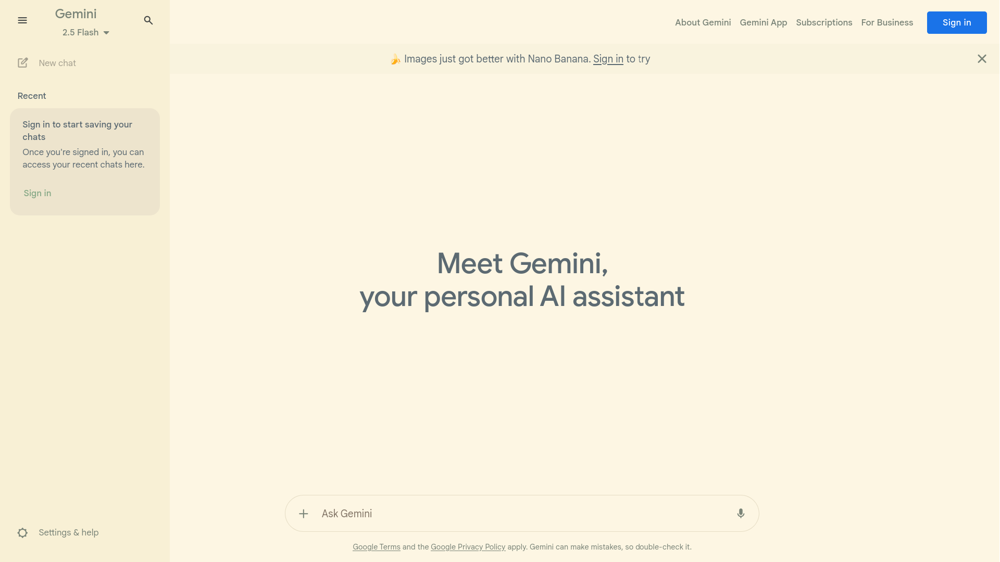
		<figcaption style="text-align:center; font-size:0.85rem; margin-top:6px;">Gemini</figcaption>
	</figure>
	<figure style="margin:0; max-width:320px;">
		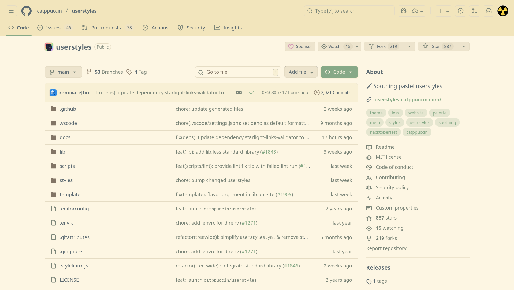
		<figcaption style="text-align:center; font-size:0.85rem; margin-top:6px;">GitHub</figcaption>
	</figure>
	<figure style="margin:0; max-width:320px;">
		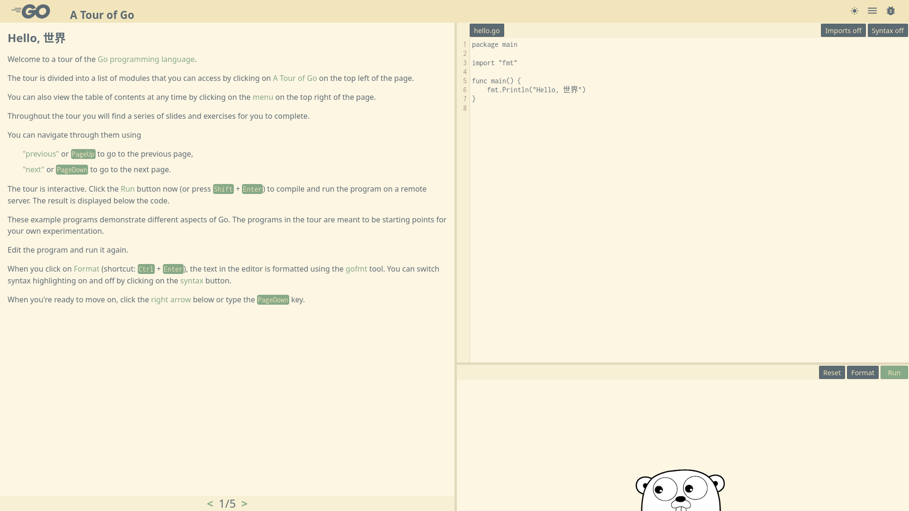
		<figcaption style="text-align:center; font-size:0.85rem; margin-top:6px;">Go Tour</figcaption>
	</figure>
	<figure style="margin:0; max-width:320px;">
		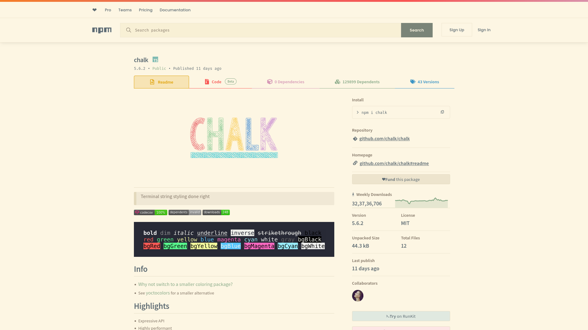
		<figcaption style="text-align:center; font-size:0.85rem; margin-top:6px;">NPM</figcaption>
	</figure>
	<figure style="margin:0; max-width:320px;">
		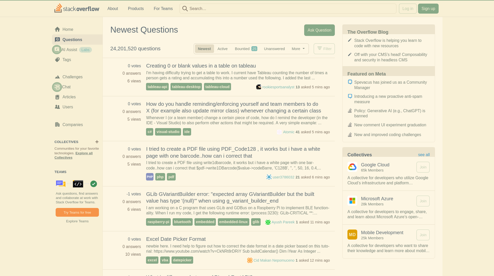
		<figcaption style="text-align:center; font-size:0.85rem; margin-top:6px;">Stack Overflow</figcaption>
	</figure>
	<figure style="margin:0; max-width:320px;">
		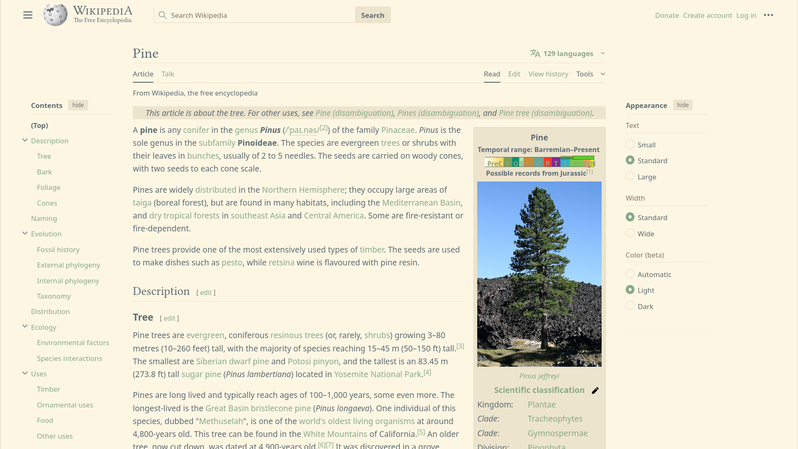
		<figcaption style="text-align:center; font-size:0.85rem; margin-top:6px;">Wikipedia</figcaption>
	</figure>

### Dark

	<figure style="margin:0; max-width:320px;">
		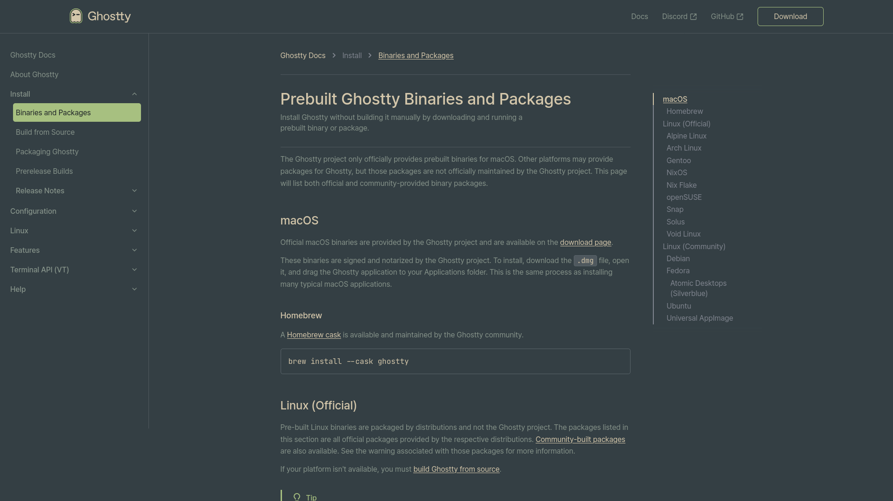
		<figcaption style="text-align:center; font-size:0.85rem; margin-top:6px;">Ghostty</figcaption>
	</figure>
	<figure style="margin:0; max-width:320px;">
		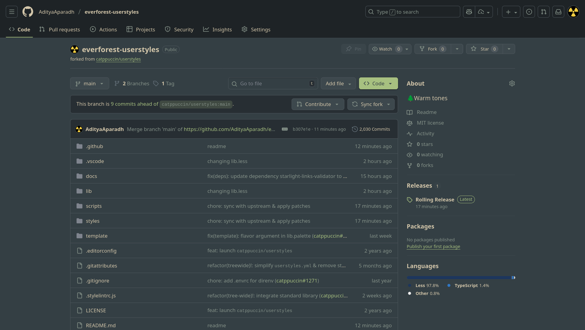
		<figcaption style="text-align:center; font-size:0.85rem; margin-top:6px;">GitHub</figcaption>
	</figure>
	<figure style="margin:0; max-width:320px;">
		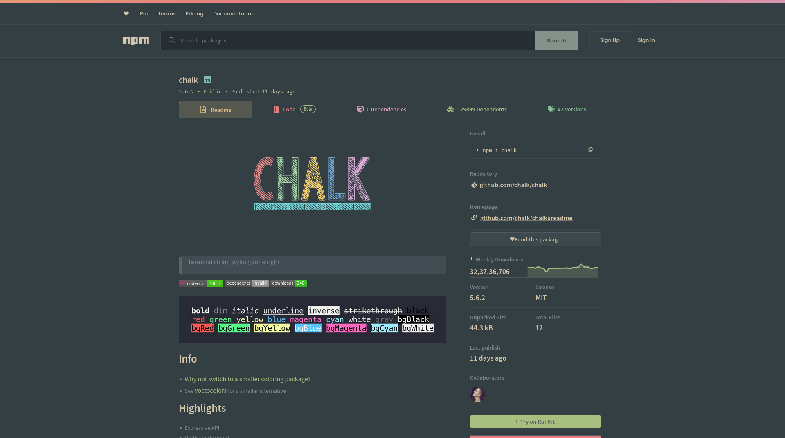
		<figcaption style="text-align:center; font-size:0.85rem; margin-top:6px;">NPM</figcaption>
	</figure>
	<figure style="margin:0; max-width:320px;">
		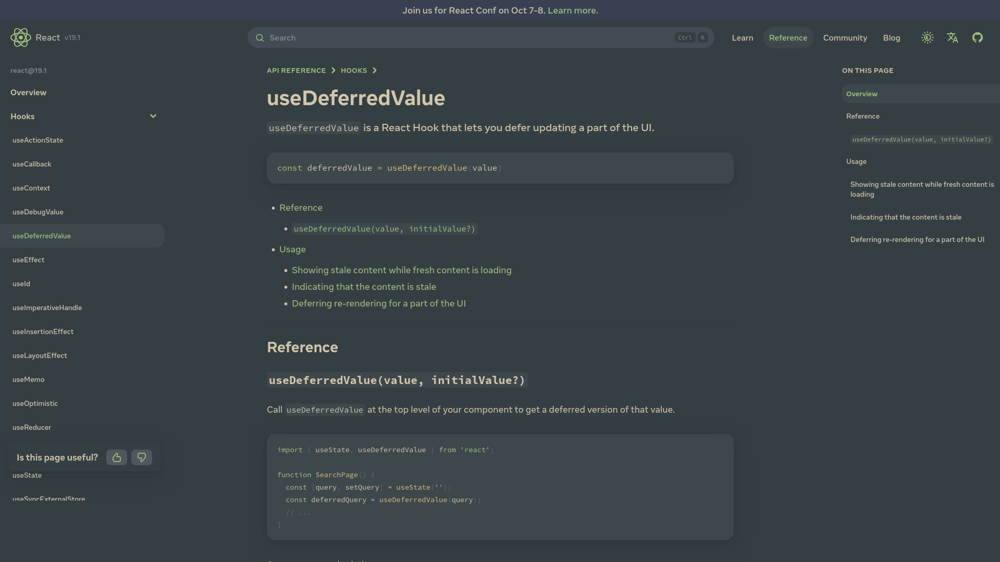
		<figcaption style="text-align:center; font-size:0.85rem; margin-top:6px;">React Dev</figcaption>
	</figure>
	<figure style="margin:0; max-width:320px;">
		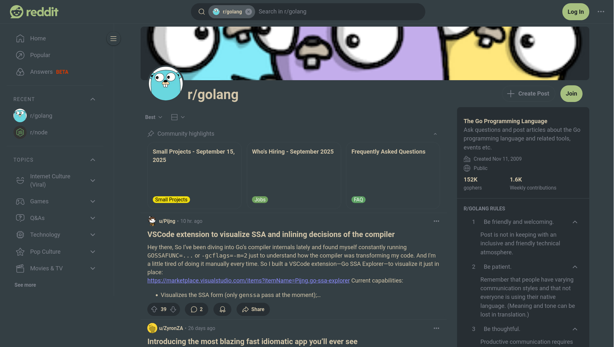
		<figcaption style="text-align:center; font-size:0.85rem; margin-top:6px;">Reddit</figcaption>
	</figure>
	<figure style="margin:0; max-width:320px;">
		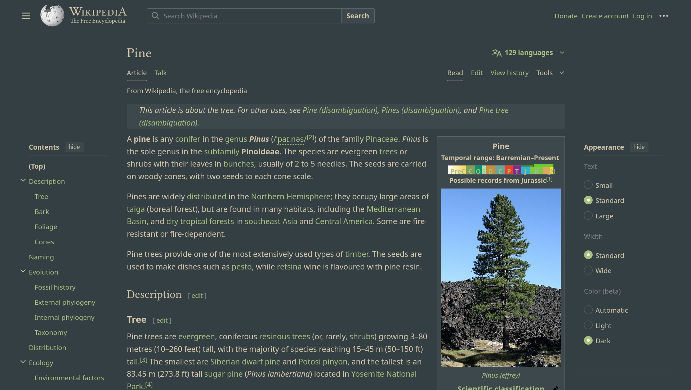
		<figcaption style="text-align:center; font-size:0.85rem; margin-top:6px;">Wikipedia</figcaption>
	</figure>

---

## License  

This project is licensed under the [MIT License](LICENSE).  

---

## Acknowledgements  

- [Catppuccin](https://github.com/catppuccin) – for the original userstyles framework.  
- [Everforest](https://github.com/sainnhe/everforest) – the awesome theme.  

